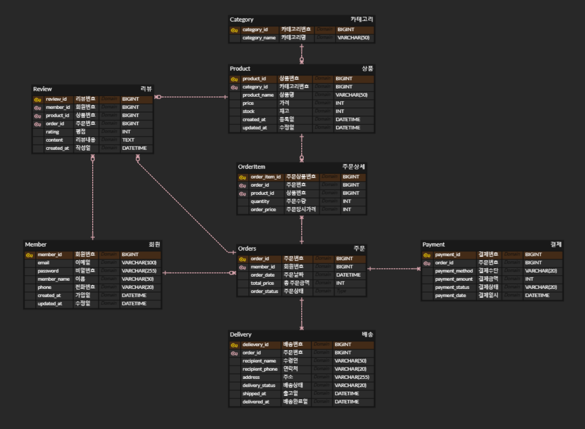

# Day 2 - Database Design

### Objective
쇼핑몰 데이터베이스 논리 설계

### Tasks
- Member 테이블 설계
- Category 테이블 설계
- Product 테이블 설계
- Orders 테이블 설계
- OrderItem 테이블 설계
- Payment 테이블 설계
- Delivery 테이블 설계
- Review 테이블 설계
- PK 및 FK 관계 설계
- ERD 관계(1:N) 정의

### OrderItem 테이블을 분리한 이유
Orders와 Product는 하나의 주문에 여러 상품이 포함될 수 있고, 하나의 상품도 여러 주문에 포함될 수 있는 **N:M(다대다)** 관계이다.

관계형 데이터베이스에서는 다대다 관계를 직접 표현하지 않기 때문에 중간 테이블인 **OrderItem**을 생성하였다.

또한 주문 상품별 **수량(quantity)**, **주문 당시 가격(order_price)** 등의 정보를 저장하여 주문 정보와 상품 정보를 분리하고 데이터 중복을 최소화하도록 설계하였다.

### Result
- 1:N, N:M 관계 이해
- OrderItem 테이블 분리 이유
- 정규화의 필요성
- 부모 테이블과 자식 테이블 개념

### ERD

