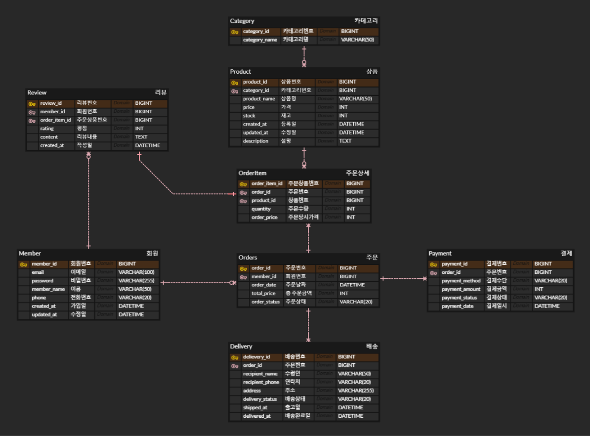

# Day 3 - Database DDL (CREATE)

### Objective

ERD를 기반으로 MySQL DDL을 작성하고 테이블을 생성한다.

### Tasks

- Member 테이블 생성
- Category 테이블 생성
- Product 테이블 생성
- Orders 테이블 생성
- OrderItem 테이블 생성
- Payment 테이블 생성
- Delivery 테이블 생성
- Review 테이블 생성
- Product 테이블 생성
- PK 설정
- FK 설정
- Primary Key(PK) 설정
- Foreign Key(FK) 설정
- NOT NULL, UNIQUE, CHECK 제약조건 적용
- DEFAULT 및 자동 시간 기록 설정

---

### Design NOTE

#### 1. OrderItem 테이블 분리 이유
Orders와 Product는 하나의 주문에 여러 상품이 포함될 수 있고, 하나의 상품도 여러 주문에 포함될 수 있는 **N:M(다대다)** 관계이다.

관계형 데이터베이스에서는 다대다 관계를 직접 표현할 수 없기 때문에 중간 테이블인 **OrderItem**을 생성하였다.

또한 상품별 **주문 수량(quantity)** 과 **주문 당시 가격(order_price)** 을 저장하여 데이터 중복을 최소화하고 주문 이력을 정확하게 관리하도록 설계하였다.

#### 2. 주문 당시 가격(order_price) 저장 이유
상품의 현재 가격(Product.price)은 변경될 수 있기 때문에 주문 당시 가격을 별도로 저장하였다.

이를 통해 가격이 변경되더라도 과거 주문 내역은 주문 당시의 가격으로 정확하게 조회할 수 있도록 설계하였다.

#### 3. Payment와 Delivery를 Orders와 1:1 관계로 설계한 이유
하나의 주문은 하나의 결제 정보와 하나의 배송 정보를 가지도록 설계하였다.

이를 위해 `order_id`에 **UNIQUE** 제약조건을 적용하여 하나의 주문에 여러 개의 결제 또는 배송 정보가 생성되지 않도록 하였다.

#### 4. Review를 OrderItem과 연결한 이유
리뷰는 주문 전체가 아닌 **구매한 개별 상품**에 대해 작성된다.

따라서 `order_id`와 `product_id`를 함께 저장하는 대신 **order_item_id**를 참조하도록 설계하여 데이터 중복을 줄이고 정규화를 적용하였다.

또한 `order_item_id`에 UNIQUE 제약조건을 적용하여 하나의 주문 상품에는 하나의 리뷰만 작성할 수 있도록 하였다.

#### 5. ERD 및 테이블 구조 개선

DDL 작성 과정에서 실제 쇼핑몰 서비스의 요구사항을 고려하여 ERD와 테이블 구조를 일부 개선하였다.

- **Product**
  - 상품 상세 설명을 저장하기 위해 `description` 필드를 추가하였다.

- **Orders**
  - `order_status`의 자료형을 `TEXT`에서 `VARCHAR(20)`으로 변경하였다.
  - 주문 상태는 정해진 짧은 문자열만 저장하므로 불필요한 저장 공간 사용을 줄이도록 설계하였다.

- **Review**
  - 기존의 `product_id`, `order_id` 컬럼을 제거하였다.
  - 대신 `order_item_id`를 참조하도록 변경하여 주문 상품과 리뷰를 직접 연결하였다.
  - 이를 통해 데이터 중복을 줄이고 정규화를 적용하였으며, `UNIQUE(order_item_id)`를 사용하여 하나의 주문 상품에는 하나의 리뷰만 작성할 수 있도록 설계하였다.

---

### ERD




---

### SQL

전체 DDL은 아래 파일에서 확인할 수 있습니다.

- [create_tables.sql](create_tables.sql)

---

### Result
- CREATE TABLE 작성
- PK / FK 제약조건 적용
- NOT NULL, UNIQUE, CHECK 사용
- DEFAULT CURRENT_TIMESTAMP 활용
- 1:1, 1:N, N:M 관계 구현
- 정규화를 고려한 테이블 설계
- 실행 가능한 쇼핑몰 데이터베이스 구축


---


# Day 4 - Database DML (INSERT)

### Objective
쇼핑몰 데이터베이스에 테스트 데이터를 삽입하여 테이블 간 관계와 외래키(Foreign Key)를 검증하고, 이후 SQL 조회(SELECT) 및 JOIN 실습을 위한 테스트 데이터를 준비한다.

---

### Tasks
- Member 데이터 입력
- Category 데이터 입력
- Product 데이터 입력
- Orders 데이터 입력
- OrderItem 데이터 입력
- Payment 데이터 입력
- Delivery 데이터 입력
- Review 데이터 입력
- 외래키(FK) 관계 검증
- 테스트 데이터 무결성 확인

---

### Design Note

#### 1. OrderItem을 사용하는 이유

처음에는 Orders 테이블에 `product_id`를 저장하는 구조를 고려했다.

하지만 하나의 주문에는 여러 개의 상품이 포함될 수 있으므로, Orders 테이블에 `product_id`를 저장하면 하나의 주문에 하나의 상품만 저장할 수 있는 문제가 발생한다.

이를 해결하기 위해 Orders와 Product 사이에 **OrderItem** 테이블을 두었다.

```
Orders (1) ----- (N) OrderItem (N) ----- (1) Product
```

OrderItem은 주문별 상품과 수량, 주문 당시 가격을 저장하여 **N:M 관계를 해소**하고, 주문 이력을 정확하게 관리할 수 있도록 설계하였다.

#### 2. Review 작성 조건

Review는 order_item_id를 참조하도록 설계하였다.

이를 통해 실제 구매한 상품에 대해서만 리뷰를 작성할 수 있으며, 테스트 데이터에서는 배송 완료된 주문에 대해서만 리뷰를 생성하여 실제 쇼핑몰의 비즈니스 로직을 반영하였다.

---

### SQL

전체 DML은 아래 파일에서 확인할 수 있습니다.

- [insert_tables.sql](insert_tables.sql)


---


### Result
- INSERT 문 작성
- 테스트 데이터 생성
- FK 관계 검증
- JOIN을 위한 데이터 준비


---


# Day 5 -  SQL 기본 조회와 정렬 (SELECT, WHERE, ORDER BY)

### Objective
쇼핑몰 데이터베이스에 삽입한 테스트 데이터를 활용하여 SELECT 문을 학습하고, 기본적인 데이터 조회 및 정렬 방법을 실습한다.

---

### TASKS
- SELECT 문 학습
- WHERE를 이용한 조건 조회
- ORDER BY를 이용한 데이터 정렬
- ASC(오름차순) 및 DESC(내림차순) 정렬 실습

---

### Design Note

#### 1. SQL 작성 순서

SQL은 일반적으로 아래 순서로 작성한다.

SELECT
FROM
WHERE
ORDER BY

#### 2. SQL 실행 순서

하지만 데이터베이스 내부에서는 아래 순서대로 실행된다.

FROM
→ WHERE
→ SELECT
→ ORDER BY

#### 3. 작성 순서와 실행 순서가 다른 이유

SQL은 사람이 읽기 쉽도록 조회할 컬럼(SELECT) 을 먼저 작성하지만, 데이터베이스는 먼저 ​어떤 테이블(FROM)에서 데이터를 가져올지 결정한 뒤, ​조건(WHERE) 을 적용하고, 필요한 컬럼을 SELECT 한 후 마지막으로 ORDER BY 를 통해 정렬을 수행한다.

이 실행 순서를 이해하면 GROUP BY, HAVING, JOIN과 같은 고급 SQL을 학습할 때도 도움이 된다.

---

### SQL

전체 DML은 아래 파일에서 확인할 수 있습니다.

- [basic_query.sql](basic_query.sql)


---


### Result
- SELECT를 이용한 전체 데이터 조회
- 필요한 컬럼만 조회하는 방법 학습
- WHERE를 이용한 조건 조회
- ORDER BY를 이용한 데이터 정렬
- WHERE와 ORDER BY를 함께 사용하는 방법 이해

---

# Day 6 - SQL 조건 검색 심화 (LIMIT, DISTINCT, LIKE, BETWEEN, IN, IS NULL, AS)

### Objective
SQL 조회 시 필요한 조건 검색 문법을 학습하고, 데이터 조회 범위를 제한하거나 원하는 조건의 데이터만 추출하는 방법을 실습한다.

---

### TASKS
- LIMIT을 이용한 조회 결과 개수 제한
- DISTINCT를 이용한 중복 데이터 제거
- LIKE를 이용한 패턴 검색
- BETWEEN을 이용한 범위 조건 조회
- IN을 이용한 다중 조건 조회
- IS NULL / IS NOT NULL을 이용한 NULL 데이터 조회
- AS를 이용한 컬럼 별칭 지정

---

### Design Note

#### 1. LIMIT 사용 이유
LIMIT은 조회 결과에서 원하는 개수만 반환하기 위해 사용한다.

데이터가 많은 테이블에서 전체 데이터를 조회하는 것은 불필요한 부하를 발생시킬 수 있기 때문에,
상위 N개의 데이터 조회나 페이징 처리 등에 활용된다.

#### 2. DISTINCT 중복 제거 기준
DISTINCT는 SELECT 절에 지정된 컬럼 전체를 기준으로 중복 여부를 판단한다.

```sql
SELECT DISTINCT category_id, price
FROM product;
```

위 경우 category_id만 비교하는 것이 아니라 (category_id + price) 조합이 동일한 경우 중복으로 판단한다.

#### 3. LIKE 패턴 검색
LIKE는 문자열 패턴 검색에 사용된다.

검색 기능 구현이나 사용자 입력 기반 조회에서 활용된다.

| 패턴    | 설명                 |
| -----   | -------------        |
| ABC%    | ABC로 시작하는 데이터 |
| %ABC    | ABC로 끝나는 데이터  |
| %ABC%   | ABC를 포함하는 데이터 |

#### 4. BETWEEN 범위 조회

BETWEEN은 특정 범위 내 데이터를 조회할 때 사용한다.

기본적으로 양쪽 값을 포함한다.

#### 5. IN 다중 조건 조회

IN은 여러 값을 OR 조건으로 비교할 때 사용한다.

#### 6. NULL 데이터 처리

NULL은 값이 존재하지 않는 상태이며 일반 비교 연산자로 조회할 수 없다.

#### 7. AS(별칭)

AS는 조회 결과의 컬럼명을 변경할 때 사용한다.

실제 테이블 구조는 변경되지 않고 조회 결과에서만 적용된다.

---

### SQL

전체 DML은 아래 파일에서 확인할 수 있습니다.

- [basic_query2.sql](basic_query2.sql)


---


### Result
- LIMIT을 이용한 조회 결과 제한
- DISTINCT를 이용한 중복 데이터 제거
- LIKE를 활용한 문자열 검색
- BETWEEN을 활용한 범위 조건 조회
- IN을 활용한 다중 조건 조회
- IS NULL을 활용한 NULL 데이터 처리
- AS를 활용한 조회 결과 가독성 개선


