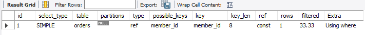
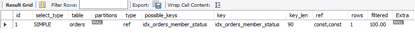

# DAY 11 - INDEX & EXPLAIN

### Objective

인덱스의 개념과 필요성을 이해하고 EXPLAIN을 활용하여 쿼리의 실행 계획을 확인

### Tasks

- 인덱스 개념 학습
- 인덱스 생성 및 삭제
- EXPLAIN을 활용한 실행 계획 확인
- 인덱스 적용 전/후 실행 계획 비교

---

### Design Note

#### 1. INDEX란?

인덱스는 테이블의 데이터를 빠르게 조회하기 위해 사용하는 자료구조이다.

책의 색인과 같이 원하는 데이터를 찾을 때 전체 데이터를 처음부터 확인하지 않고
인덱스를 통해 탐색 범위를 좁혀 데이터를 빠르게 찾을 수 있다.

#### 2. 왜 사용하는가

- 쿼리의 조회 성능을 개선하기 위해
- 쿼리가 인덱스를 사용하고 있는지 확인하기 위해
- JOIN이 많은 쿼리의 실행 계획을 확인하기 위해

#### 3. 인덱스 적용 전과 후 EXPLAIN 비교

`member_name`을 조건으로 회원을 조회하는 쿼리를 대상으로
인덱스 적용 전과 후의 실행 계획을 비교하였다.

##### 적용 전

인덱스가 없어 테이블 전체를 검사하는 Full Table Scan이 발생한다.

 | 항목              | 값                 | 의미                          |
| ---------- | ------------- | --------------------------- |
| `type`     | `ALL`         | 테이블을 전체적으로 확인하는 방식 |
| `key`      | `NULL`        | 사용한 인덱스 없음             |
| `rows`     | `4`           | MySQL이 검사할 것으로 예상한 행 수      |
| `filtered` | `25%`         | 조회 대상 중 조건을 만족할 것으로 예상되는 비율 |
| `Extra`    | `Using where` | WHERE 조건을 사용하여 행을 필터링 |

   

##### 적용 후

`member_name` 인덱스를 생성한 후 실행 계획을 확인하였다.

인덱스를 이용하여 조건에 맞는 데이터를 탐색하고, 탐색 범위를 좁혀 조회할 수 있다.

   | 항목              | 값                 | 의미                          |
| --------------- | ----------------- | --------------------------- |
| `type`          | `ref`             | 인덱스를 이용해서 조건에 맞는 값을 찾음      |
| `possible_keys` | `idx_member_name` | 사용할 수 있는 인덱스                |
| `key`           | `idx_member_name` | **실제로 사용한 인덱스**             |
| `rows`          | `1`               | MySQL이 검사할 것으로 예상한 행 수      |
| `filtered`      | `100.00`          | 조회 대상 중 조건을 만족할 것으로 예상되는 비율 |


#### 4. EXPLAIN

EXPLAIN을 사용하면 SQL 쿼리를 실행할 때 MySQL이 어떤 방식으로 데이터를 조회하는지 실행 계획을 확인할 수 있다.

인덱스 적용 전에는 `type = ALL`, `key = NULL`로 전체 테이블을 탐색하는 것을 확인하였다.

인덱스 적용 후에는 `type = ref`, `key = idx_member_name`으로 변경되어 생성한 인덱스를 사용하여 조회하는 것을 확인하였다.

#### 5. 자동으로 생성되는 인덱스

PRIMARY KEY와 UNIQUE 제약 조건을 설정하면 해당 컬럼에 인덱스가 자동으로 생성된다.

---

### SQL

인덱스 생성 및 EXPLAIN 실행 관련 SQL은 아래 파일에서 확인할 수 있습니다.

- [index.sql](./index.sql)

---

### Result

- `member_name`에 인덱스를 생성하고 삭제하는 과정 실습
- EXPLAIN을 통해 인덱스 적용 전/후 실행 계획 비교
- 인덱스 적용 전 `type = ALL`, `key = NULL`로 전체 테이블을 탐색하는 것을 확인
- 인덱스 적용 후 `type = ref`, `key = idx_member_name`으로 인덱스를 사용하는 것을 확인
- PRIMARY KEY와 UNIQUE 제약 조건에 의해 인덱스가 자동으로 생성되는 것을 확인


---


# DAY 12 - COMPOSITE INDEX

### Objective

복합 인덱스의 개념과 컬럼 순서의 중요성을 이해하고 EXPLAIN을 활용하여 복합 인덱스의 적용 결과를 확인한다

### Tasks

- 복합 인덱스 개념 학습
- 복합 인덱스 생성 및 삭제
- 복합 인덱스 적용 전/후 실행 계획 비교
- 복합 인덱스의 선두 컬럼에 따른 인덱스 사용 여부 확인

---

### Design Note

#### 1. 복합 인덱스란?

복합 인덱스는 두 개 이상의 컬럼을 하나의 인덱스로 구성한 것이다.

여러 조건을 함께 사용하는 조회 쿼리의 성능을 개선하기 위해 사용할 수 있다.


```sql
CREATE INDEX idx_orders_member_status
ON orders(member_id, order_status);
```

#### 2. 복합 인덱스의 컬럼 순서

복합 인덱스는 컬럼의 순서가 중요하다.

(member_id, order_status)로 생성한 경우 member_id가 선두 컬럼이 된다.

- member_id 조건 → 인덱스 사용 가능
- member_id + order_status 조건 → 인덱스 사용 가능
- order_status 조건만 사용 → 인덱스를 효율적으로 사용하기 어려움

#### 3. 단일 인덱스와 복합 인덱스 비교

orders 테이블에서 다음 조건의 조회를 대상으로 실행 계획을 비교하였다.

```sql
EXPLAIN
SELECT *
FROM orders
WHERE member_id = 1
  AND order_status = '결제완료';
```

#### 복합 인덱스 적용 전

기존 member_id 인덱스를 사용하여 member_id 조건은 인덱스로 조회하지만,
order_status 조건은 추가적으로 필터링하는 것을 확인하였다.



| 항목         | 값           | 의미                     |
| ---------- | ----------- | ---------------------- |
| `type`     | `ref`       | 인덱스를 이용하여 조회           |
| `key`      | `member_id` | `member_id` 인덱스 사용     |
| `rows`     | `1`         | MySQL이 검사할 것으로 예상한 행 수 |
| `filtered` | `33.33`     | 추가 조건을 만족할 것으로 예상되는 비율 |


#### 복합 인덱스 적용 후

(member_id, order_status) 복합 인덱스를 생성한 후 두 조건을 함께 사용하는 것을 확인하였다.



| 항목              | 값                          | 의미                          |
| --------------- | -------------------------- | --------------------------- |
| `type`          | `ref`                      | 인덱스를 이용하여 조회                |
| `possible_keys` | `idx_orders_member_status` | 사용할 수 있는 인덱스                |
| `key`           | `idx_orders_member_status` | 실제로 사용한 인덱스                 |
| `rows`          | `1`                        | MySQL이 검사할 것으로 예상한 행 수      |
| `filtered`      | `100.00`                   | 조회 대상 중 조건을 만족할 것으로 예상되는 비율 |

#### 4. 선두 컬럼 확인

복합 인덱스가 다음과 같이 구성된 경우:
(member_id, order_status)

member_id가 선두 컬럼이므로 member_id를 조건으로 사용하는 조회에서는 인덱스를 활용할 수 있다.

반면 order_status만 조건으로 사용하는 경우 선두 컬럼인 member_id를 건너뛰므로 해당 복합 인덱스를 효율적으로 사용하기 어렵다.

#### 5. 인덱스 설계 시 주의사항

인덱스는 무조건 많이 생성하는 것이 아니라 실제 조회 패턴에 맞게 필요한 인덱스를 생성해야 한다.

member_id만 조회하는 경우 이미 PRIMARY KEY 인덱스가 존재하므로 (member_id, order_status) 복합 인덱스를 추가로 생성할 필요가 없다.

### Result

- 복합 인덱스의 개념과 선두 컬럼의 중요성을 이해
- member_id 단일 인덱스와 (member_id, order_status) 복합 인덱스의 실행 계획 비교
- 복합 인덱스를 통해 여러 조건을 함께 조회할 수 있음을 확인
- order_status만 조건으로 사용할 경우 복합 인덱스를 효율적으로 사용하기 어려움을 확인
- 실제 조회 패턴에 맞게 필요한 인덱스를 설계해야 함을 확인


# DAY 13 - INDEX 활용과 비활용

### Objective

인덱스가 존재하더라도 쿼리 조건에 따라 인덱스가 사용되지 않을 수 있음을 이해하고 EXPLAIN을 통해 확인

### Tasks

- LIKE 조건에서 인덱스 활용 여부 확인
- 컬럼에 함수를 사용하는 경우 인덱스 활용 여부 확인
- EXPLAIN을 활용한 실행 계획 비교
- 인덱스를 효율적으로 사용할 수 있는 조건 이해

---

### Design Note

#### 1. LIKE 조건에 따른 인덱스 사용

`product_name`에 인덱스를 생성한 후 LIKE 조건에 따른 실행 계획을 비교하였다.

```sql
CREATE INDEX idx_product_name
ON product(product_name);
```

`LIKE 'Pro%'`  

Pro로 시작하는 값을 찾기 때문에 인덱스를 이용하여 검색 범위를 좁힐 수 있다. 
-> **인덱스 활용 가능**

`LIKE '%Pro%'` 

Pro가 어느 위치에서 시작하는지 알 수 없기 때문에 일반적인 B-Tree 인덱스를 효율적으로 활용하기 어렵다. 
-> **인덱스 활용 어려움**


#### 2. 컬럼에 함수를 사용하는 경우

'created_at'에 인덱스를 생성한 후 날짜 조건을 비교하였다.

```sql
CREATE INDEX idx_product_created_at
ON product(created_at);
```

'범위 조건'

```sql
WHERE created_at >= '2026-01-01'
  AND created_at < '2027-01-01'
```
created_at 자체의 값 범위를 검색하기 때문에 **인덱스를 활용하기 유리하다**.

'함수 사용'

```sql
WHERE YEAR(created_at) = 2026
```
created_at에 YEAR() 함수를 적용하기 때문에 일반적인 **인덱스를 효율적으로 활용하기 어렵다**.

#### 3. 인덱스 사용 시 주의사항

인덱스가 존재한다고 해서 모든 쿼리가 인덱스를 사용하는 것은 아니다.

쿼리의 조건이나 데이터의 양 등에 따라 MySQL이 인덱스를 사용하지 않을 수도 있으며, EXPLAIN을 통해 실제 실행 계획을 확인할 수 있다.

### Result

- LIKE 'Pro%'와 LIKE '%Pro%'의 인덱스 활용 차이를 확인
- 컬럼에 YEAR() 함수를 적용했을 때 인덱스를 효율적으로 활용하기 어려움을 확인
- 인덱스가 존재하더라도 쿼리 작성 방식에 따라 인덱스가 사용되지 않을 수 있음을 확인
- EXPLAIN을 활용하여 인덱스 사용 여부를 확인
- 인덱스를 고려하여 효율적인 조회 조건을 작성하는 방법을 이해
